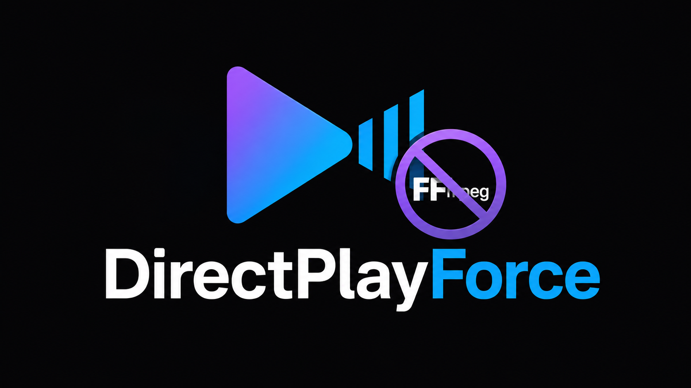

# DirectPlayForce



[](https://github.com/upchui/Jellyfin-DirectPlayForce/actions/workflows/build.yml)
[](https://github.com/upchui/Jellyfin-DirectPlayForce/releases/latest)
[](https://jellyfin.org)
[](LICENSE)

A [Jellyfin](https://jellyfin.org) server plugin that forces **direct play** for configured clients, blocking all server-side transcoding. The server delivers media files exactly as stored — no FFmpeg, no re-encoding, zero quality loss on both video and audio.

---

## The Problem

The Jellyfin Android TV app on NVIDIA Shield (and other Android TV devices) reports **EAC3 / Dolby Digital Plus** as supported in its device profile. Jellyfin trusts this and delivers EAC3 via HLS/TS remux. However, ExoPlayer on the Shield plays EAC3 incorrectly — extreme stuttering, audio freeze, roughly one frame per second.

No amount of server-side transcoding to another codec (AC3, FLAC, AAC, PCM, Opus, DTS) produces a consistently working result for 7.1 surround in the HLS/TS container. The only reliable solution: **force the server to deliver the original file via direct play**, letting ExoPlayer handle the full MKV container natively — where EAC3, TrueHD, DTS, and all surround configurations work correctly.

---

## Features

- ✅ Forces direct play for any configured client or device
- ✅ Per-rule client/device/device-ID filtering
- ✅ No FFmpeg, no re-encoding, no quality loss (video or audio)
- ✅ All channel configurations preserved (5.1, 7.1, Atmos)
- ✅ Other clients are completely unaffected
- ✅ Configuration via Jellyfin Dashboard (no server restart needed)
- ✅ Install via Jellyfin plugin repository or manually

---

## Requirements

- Jellyfin **10.9.0** or later
- .NET 8 runtime (provided by Jellyfin)

---

## Installation

### Option 1: Jellyfin Plugin Repository (recommended)

1. Open **Jellyfin Dashboard** → **Plugins** → **Repositories**
2. Click **+** and add:
   ```
   https://raw.githubusercontent.com/upchui/Jellyfin-DirectPlayForce/main/manifest.json
   ```
3. Go to **Catalog** and search for **DirectPlayForce**
4. Install and restart Jellyfin
5. Configure under **Dashboard → Plugins → DirectPlayForce**

### Option 2: Manual Installation

1. Download `Jellyfin.Plugin.DirectPlayForce.zip` from the [latest release](https://github.com/upchui/Jellyfin-DirectPlayForce/releases/latest)
2. Extract the contents into your Jellyfin plugins folder:
   ```
   /config/plugins/DirectPlayForce_2.0.0.0/
   ├── Jellyfin.Plugin.DirectPlayForce.dll
   └── meta.json
   ```
   Common plugin paths:
   | Environment | Path |
   |-------------|------|
   | Docker (jellyfin/jellyfin) | `/config/plugins/` |
   | Linux (systemd) | `/var/lib/jellyfin/plugins/` |
   | Windows | `%APPDATA%\Jellyfin\plugins\` |
3. Restart Jellyfin
4. Configure under **Dashboard → Plugins → DirectPlayForce**

---

## Configuration

### Add a Direct Play Rule

1. Open **Dashboard → Plugins → DirectPlayForce → Settings**
2. Click **+ Add rule**
3. Fill in the filters:

| Field | Description | Example |
|-------|-------------|---------|
| **Client Filter** | Substring of the client app name | `Android TV` |
| **Device Filter** | Substring of the device name | `Living Room` |
| **Device ID** | Exact device ID (optional, for single-device targeting) | *(leave empty)* |

4. Click **Save** — takes effect on the next playback session (no restart needed)

### Finding Your Client and Device Names

Check the Jellyfin log after starting playback:
```
DirectPlayForce: PlaybackInfo from Client='Jellyfin Android TV' Device='Living Room' — checking rules
```

Or look in **Dashboard → Dashboard → Active Streams** while a stream is running.

### Example: Fix EAC3 Stuttering on NVIDIA Shield

| Field | Value |
|-------|-------|
| Client Filter | `Android TV` |
| Device Filter | *(leave empty, matches all Shield devices)* |
| Device ID | *(leave empty)* |

With this rule, the Shield will always receive the original file. EAC3, TrueHD, DTS-HD MA — all audio formats play natively through ExoPlayer without stuttering.

---

## How It Works

The plugin registers an ASP.NET Core action filter that intercepts `POST /Items/{id}/PlaybackInfo` requests **after** Jellyfin processes them. When a matching rule is found, it patches the response:

```
MediaSource.SupportsDirectPlay  = true
MediaSource.SupportsDirectStream = true
MediaSource.TranscodingUrl       = ""   ← no transcoding path offered
```

The client receives a response with only the direct play URL available. Jellyfin's streaming framework serves the original file byte-for-byte via HTTP. ExoPlayer handles the MKV container and all contained codecs natively.

**Why not just transcode to a compatible codec?**  
Every tested transcoding target (AC3, EAC3, FLAC, PCM, AAC, Opus, DTS) has compatibility issues with 7.1 surround in the MPEG-TS / HLS container used by the Android TV app. Direct play of the original MKV works reliably for all audio formats.

---

## Build from Source

All compilation happens inside Docker — no local .NET SDK required.

```bash
git clone https://github.com/upchui/Jellyfin-DirectPlayForce.git
cd Jellyfin-DirectPlayForce
chmod +x build.sh
./build.sh
# Output: dist/Jellyfin.Plugin.DirectPlayForce.zip
```

**Requirements:** Docker with BuildKit (default since Docker 23).

---

## License

[MIT](LICENSE)
